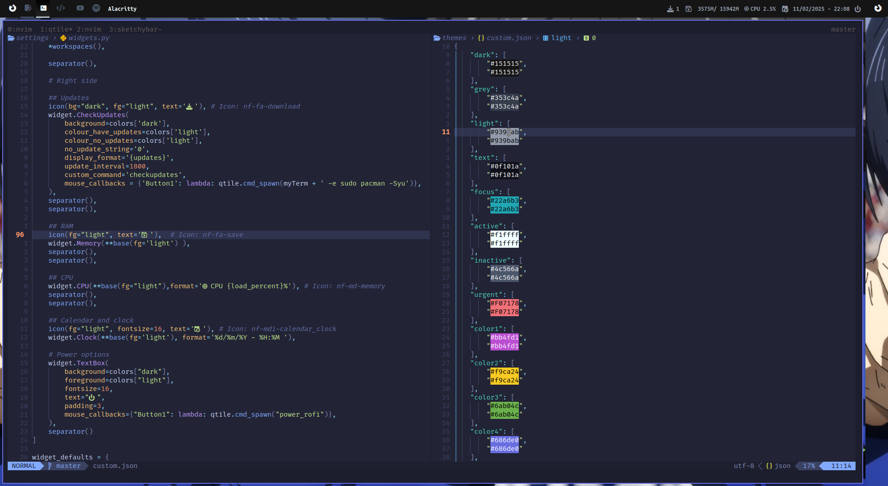

# Dotfiles of Adrián Arnaiz

This is the configuration of the Linux terminal.

## Includes

- Shell: ZSH + OH-MY-ZSH + Powerlevel10k theme
- Plugins: Zgen
- Essentials tools: wget + git
- CLI Editors: vim + nano + neovim
- CLI tools: jq
- API/Request tools: curl + http
- Help/Info: man + tldr + neofetch
- Fun: lolcat
- Compressors/conversors: unzip + zip
- Package Managers: Node/NVM/PNPM
- Containers: Docker
- Customize appareance: lxappearance
- System icons: network-manager-applet

## Installation

```sh
git clone https://github.com/arnaiz23/dotfiles ~/.dotfiles
cd .dotfiles
sh installer/arch_linux.sh || sh installer/ubuntu.sh
nvm install --lts (or other version)
```

## Requisites

If you don't have a non-root user with sudo privileges, create it before run this script:

adduser arnaiz --quiet
usermod -aG sudo arnaiz
apt update -y && apt install -y sudo git
su arnaiz

## Structure of repository

- editors
  - nvim: Nvim configuration
  - code: VSCode configuration
- os
  - linux: Linux and linux app Configurations
  - apps: Configurations of global applications
- scripts: Folder with all custom scripts
- shell
  - zsh: Folder with all the zsh configuration

## Neovim / Vim

Configuration of neovim (IDE mode)

**Necessary the xclip in linux for the clipboard**

// TODO

- Execute: `:PackerInstall`

## TMUX

Create a symbolic link in ~/ from $DOTFILES_PATH/os/apps/tmux/.tmux.conf

- Execute:
  - `tmux`
  - `Ctrl + r and Ctrl + I`
- Other keybindings
- `Ctrl-Space` -> leader
- `Ctrl-Space [` -> enter in copy mode
  - vi keys move
- `leader + ?` -> help commands

## QTILE

Currently, I'm using a minimalist configuration of qtile.



## Scripts

- tmux-start.sh -> script for create a tmux ide
- tmux-session.sh -> With gum, create a menu that show you all the tmux sessions and access it.
- power_rofi.sh -> Custom script for show you all the PC energy options (Power off, Restart, Suspend, Lock)

### Uses

```bash
	sudo ln -s ~/.dotfiles/scripts/${script_name} /usr/local/bin/${name}
```

### Appareance

Download the `.zip` of the theme that you want. Copy in the folder `~/.themes` and extract here. With the program `lxappearance` you can select this. The same steps for icons but the folder is `~/.icons`. Download GTK themes.

### GRUB theme

I use the [darkmatter - Linux](https://github.com/VandalByte/darkmatter-grub2-theme)

### Rofi

For the theme of rofi, I use this [repository](https://github.com/newmanls/rofi-themes-collection) or you can use the Nord Theme that I have in `$DOTFILES_PATH/os/linux/rofi/themes/nord.rasi`
